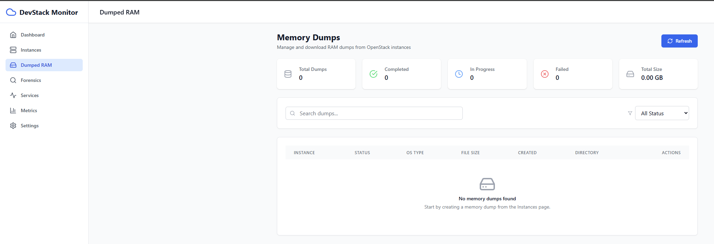
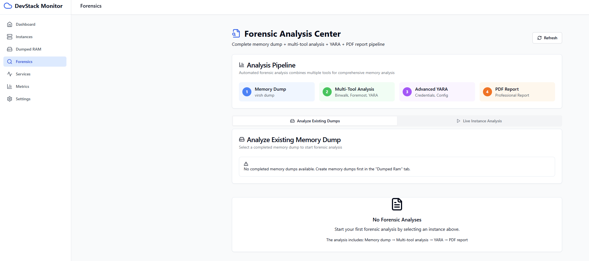
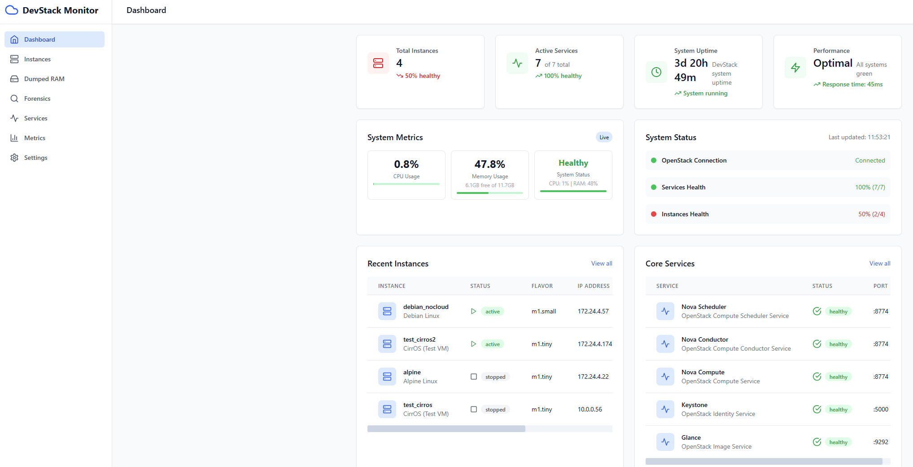

# DevStack Monitor and Analysis Plugin

[](https://www.gnu.org/licenses/gpl-3.0)
[](https://www.python.org/downloads/)
[](https://nodejs.org/)
[](https://fastapi.tiangolo.com/)
[](https://reactjs.org/)

A comprehensive monitoring and forensic analysis plugin for OpenStack DevStack environments. This plugin provides real-time monitoring of OpenStack services and instances, along with advanced memory dump analysis and forensic capabilities through an integrated web dashboard.

## 🚀 Features

### 🔍 Real-time Monitoring
- **Service Health Monitoring**: Track status of all OpenStack services (Nova, Neutron, Cinder, Glance, Keystone)
- **Instance Management**: Monitor running instances, their states, and resource utilization
- **System Metrics**: CPU, memory, disk usage, and network statistics
- **Alert System**: Configurable alerts for service failures and resource thresholds

### 🛡️ Forensic Analysis
- **Memory Dump Analysis**: Automated memory dump creation from running instances




- **Multi-tool Analysis Pipeline**: Integrated analysis using:
  - **Binwalk**: Firmware and file system analysis
  - **Foremost**: File carving and recovery
  - **Strings**: Extract readable strings from memory dumps
  - **Hexdump**: Binary analysis and inspection
  - **YARA**: Pattern matching and malware detection
- **PDF Report Generation**: Comprehensive analysis reports with findings and statistics
- **Web-based Interface**: Easy-to-use forensic analysis dashboard




### 🎛️ Web Dashboard
- **Modern React Interface**: Responsive design with real-time updates
- **Multiple Views**: Dashboard, Services, Instances, Metrics, and Settings
- **Real-time Updates**: WebSocket-based live data streaming
- **Interactive Charts**: Visual representation of metrics and trends
- **Export Capabilities**: Download reports and analysis results



## 📋 Prerequisites

- **DevStack Environment**: Working OpenStack DevStack installation
- **Operating System**: Ubuntu 20.04+ or compatible Linux distribution
- **Python**: 3.8 or higher
- **Node.js**: 18.0 or higher
- **Git**: For cloning the repository
- **Sudo Access**: For system-level configuration

## 🔧 Installation

### Automated Installation (Recommended)

1. **Clone the repository**:
   ```bash
   git clone https://github.com/colby09/devstack-monitor-analysis.git
   cd devstack-monitor-analysis
   ```

2. **Run the installation script**:
   ```bash
   chmod +x install-devstack-monitor-plugin.sh
   ./install-devstack-monitor-plugin.sh
   ```

3. **Follow the prompts** and restart DevStack:
   ```bash
   cd /opt/stack/devstack
   ./unstack.sh && ./stack.sh
   ```

### Manual Installation

<details>
<summary>Click to expand manual installation steps</summary>

1. **Install system dependencies**:
   ```bash
   sudo apt-get update
   sudo apt-get install -y nodejs npm python3-pip python3-venv
   sudo apt-get install -y binutils foremost hexdump yara python3-yara
   ```

2. **Set up Python environment**:
   ```bash
   python3 -m venv .venv
   source .venv/bin/activate
   pip install -r backend/requirements.txt
   ```

3. **Build frontend**:
   ```bash
   npm install
   npm run build
   ```

4. **Configure DevStack integration**:
   Add to `/opt/stack/devstack/local.conf`:
   ```ini
   enable_plugin devstack-monitor-analysis /path/to/plugin
   ```

5. **Set up forensic environment**:
   ```bash
   sudo mkdir -p /home/stack/forensic/{reports,dumps,temp}
   sudo chown -R stack:stack /home/stack/forensic
   ```

</details>

## 🚀 Usage

### Starting the Plugin

> **Note**: Before using these methods, make sure you have completed the installation process using `./install-devstack-monitor-plugin.sh`

#### Method 1: Using the activation script (after installation)
```bash
# The installation script creates an activation script at:
/opt/stack/devstack-monitor-analysis/activate-plugin.sh

# Note: A template activate-plugin.sh is included in this repository 
# for reference, but the actual working script is created during installation
```

#### Method 2: Using systemd service
```bash
sudo systemctl start devstack-monitor
sudo systemctl enable devstack-monitor  # For auto-start
```

#### Method 3: Manual start
```bash
source .venv/bin/activate
cd backend
python main.py
```

### Accessing the Dashboard

Once started, access the web dashboard at:
- **Main Dashboard**: http://localhost:8080
- **API Documentation**: http://localhost:8080/docs
- **Metrics API**: http://localhost:8080/api/metrics/summary

### 🌐 Remote Access

The dashboard can be accessed from any remote workstation on the network by replacing `localhost` with the DevStack server's IP address:

- **Main Dashboard**: `http://YOUR_DEVSTACK_IP:8080`
- **Services Monitor**: `http://YOUR_DEVSTACK_IP:8080/services`
- **Instance Management**: `http://YOUR_DEVSTACK_IP:8080/instances`
- **Forensic Analysis**: `http://YOUR_DEVSTACK_IP:8080/forensics`
- **System Metrics**: `http://YOUR_DEVSTACK_IP:8080/metrics`
- **Settings Panel**: `http://YOUR_DEVSTACK_IP:8080/settings`
- **API Documentation**: `http://YOUR_DEVSTACK_IP:8080/docs`
- **Health Check**: `http://YOUR_DEVSTACK_IP:8080/health`

**Example**: If your DevStack server runs on `192.168.1.100`, access the dashboard at:
- Main: `http://192.168.1.100:8080`
- API: `http://192.168.1.100:8080/docs`

> **Note**: Ensure that port 8080 is accessible through the server's firewall. You may need to run:
> ```bash
> sudo ufw allow 8080
> ```

## 🎯 Dashboard Sections

### 📊 Dashboard
- Overview of system health and status
- Quick access to key metrics
- Recent alerts and notifications
- System summary cards

### 🔧 Services
- List of all OpenStack services
- Real-time status monitoring
- Service restart capabilities
- Configuration viewing

### 🖥️ Instances
- Active instance management
- Instance state monitoring
- Memory dump triggering
- Forensic analysis initiation

### 📈 Metrics
- System performance charts
- Resource utilization trends
- Historical data visualization
- Export capabilities

### ⚙️ Settings
- Plugin configuration
- Alert thresholds
- Export settings
- System preferences

## 🛡️ Forensic Analysis Workflow

### 1. Memory Dump Creation
```bash
# Trigger via API
curl -X POST "http://localhost:8080/api/dumps/create" \
  -H "Content-Type: application/json" \
  -d '{"instance_id": "your-instance-id"}'
```

### 2. Analysis Pipeline
The plugin automatically processes memory dumps through:

1. **Binwalk Analysis**: Identifies file systems and embedded files
2. **Foremost Recovery**: Carves and recovers deleted files
3. **String Extraction**: Finds readable text and patterns
4. **Hexdump Analysis**: Binary structure examination
5. **YARA Scanning**: Malware and pattern detection

### 3. Report Generation
- **Automated PDF Reports**: Comprehensive analysis summaries
- **JSON Data Export**: Raw analysis results
- **Web Interface Review**: Interactive result browsing

### Example Analysis API Call
```bash
# Start integrated forensic analysis
curl -X POST "http://localhost:8080/api/forensic/analyze" \
  -H "Content-Type: application/json" \
  -d '{"instance_id": "your-instance-id", "instance_name": "web-server"}'

# Check analysis status
curl "http://localhost:8080/api/forensic/status/analysis-id"

# Download PDF report
curl "http://localhost:8080/api/forensic/report/analysis-id" -o report.pdf
```

## 🏗️ Architecture

### Backend (FastAPI)
```
backend/
├── app/
│   ├── api/             # API endpoints
│   │   ├── routes.py    # Main router
│   │   └── endpoints/   # Specific endpoint modules
│   ├── core/            # Core configuration
│   ├── models/          # Data models
│   └── services/        # Business logic
│       ├── openstack.py       # OpenStack integration
│       ├── monitor.py          # System monitoring
│       ├── integrated_forensic.py  # Forensic analysis
│       └── websocket.py        # Real-time updates
└── requirements.txt     # Python dependencies
```

### Frontend (React + TypeScript)
```
src/
├── components/          # Reusable UI components
├── pages/              # Page components
├── utils/              # Utility functions
└── main.tsx           # Application entry point
```

### DevStack Integration
```
devstack/
├── plugin.sh          # DevStack plugin definition
└── settings           # Plugin configuration
```

## 🔌 API Endpoints

### System Monitoring
- `GET /api/services` - List OpenStack services
- `GET /api/instances` - List instances
- `GET /api/metrics/summary` - System metrics
- `GET /api/health` - Health check

### Memory Management
- `POST /api/dumps/create` - Create memory dump
- `GET /api/dumps` - List dumps
- `GET /api/dumps/{dump_id}` - Dump details
- `GET /api/dumps/{dump_id}/download` - Download dump

### Forensic Analysis
- `POST /api/forensic/analyze` - Start analysis
- `GET /api/forensic/analyses` - List analyses
- `GET /api/forensic/status/{analysis_id}` - Analysis status
- `GET /api/forensic/report/{analysis_id}` - Download report

### WebSocket Endpoints
- `/ws/metrics` - Real-time metrics updates
- `/ws/services` - Service status updates
- `/ws/instances` - Instance status updates

## ⚙️ Configuration

### Environment Variables
```bash
# OpenStack Configuration
OS_AUTH_URL=http://devstack-controller:5000/v3
OS_PROJECT_NAME=admin
OS_USERNAME=admin
OS_PASSWORD=secretpass
OS_USER_DOMAIN_NAME=Default
OS_PROJECT_DOMAIN_NAME=Default

# Plugin Configuration
PLUGIN_LOG_LEVEL=INFO
FORENSIC_BASE_DIR=/home/stack/forensic
MAX_CONCURRENT_ANALYSES=3
```

### local.conf Integration
Add to your DevStack `local.conf`:
```ini
[[local|localrc]]
# Enable the monitoring plugin
enable_plugin devstack-monitor-analysis /opt/stack/devstack-monitor-analysis

# Optional: Configure plugin settings
MONITOR_PLUGIN_PORT=8080
MONITOR_PLUGIN_DEBUG=True
```

## 📊 Monitoring Capabilities

### System Metrics
- **CPU Usage**: Real-time processor utilization
- **Memory Usage**: RAM consumption and availability
- **Disk Usage**: Storage utilization across filesystems
- **Network I/O**: Network traffic and throughput
- **Load Average**: System load indicators

### OpenStack Metrics
- **Service Status**: Health of all OpenStack components
- **Instance Status**: Virtual machine states and resources
- **API Response Times**: Performance monitoring
- **Error Rates**: Failure tracking and analysis

### Custom Alerts
Configure alerts for:
- High CPU/Memory usage (configurable thresholds)
- Service failures or restarts
- Disk space warnings
- Instance state changes
- Failed API requests

## 🛠️ Development

### Setting up Development Environment

1. **Clone and setup**:
   ```bash
   git clone https://github.com/colby09/devstack-monitor-analysis.git
   cd devstack-monitor-analysis
   ```

2. **Backend development**:
   ```bash
   cd backend
   python -m venv .venv
   source .venv/bin/activate
   pip install -r requirements.txt
   python main.py
   ```

3. **Frontend development**:
   ```bash
   npm install
   npm run dev  # Development server with hot reload
   ```

### Code Structure

- **Backend**: FastAPI-based REST API with WebSocket support
- **Frontend**: React with TypeScript, Vite build system
- **Styling**: Tailwind CSS for responsive design
- **State Management**: React hooks and context
- **API Client**: Axios for HTTP requests

### Adding New Features

1. **Backend endpoints**: Add to `backend/app/api/endpoints/`
2. **Frontend pages**: Add to `src/pages/`
3. **Components**: Add to `src/components/`
4. **Services**: Add business logic to `backend/app/services/`

## 🧪 Testing

### Testing the Installation
```bash
# Run the installation test (created after installation)
/opt/stack/devstack-monitor-analysis/test-installation.sh

# Test specific components
python -m pytest backend/tests/  # Backend tests
npm test                         # Frontend tests
```

### Testing Forensic Analysis
```bash
# Test forensic analysis pipeline (if available)
# Note: test-forensics-system.sh may need to be created manually
./test-forensics-system.sh

# Test with a sample memory dump
curl -X POST "http://localhost:8080/api/forensic/test-analysis"
```

### Manual Testing Checklist
- [ ] Dashboard loads correctly
- [ ] Services page shows OpenStack services
- [ ] Instances page displays running VMs
- [ ] Metrics page shows system charts
- [ ] Memory dump creation works
- [ ] Forensic analysis completes successfully
- [ ] PDF reports generate correctly
- [ ] WebSocket updates work in real-time

## 🚨 Troubleshooting

### Common Issues

#### Plugin Not Starting
```bash
# Check logs
journalctl -u devstack-monitor -f

# Verify Python environment
source .venv/bin/activate
python -c "import fastapi; print('FastAPI OK')"

# Check port availability
netstat -tlnp | grep 8080
```

#### OpenStack Connection Issues
```bash
# Verify OpenStack credentials
source /opt/stack/devstack/openrc admin admin
openstack service list

# Check configuration
cat backend/app/core/config.py
```

#### Forensic Analysis Failures
```bash
# Check forensic tools installation
which binwalk foremost strings hexdump yara

# Verify forensic directory permissions
ls -la /home/stack/forensic/

# Test forensic script directly
cd /home/stack/plugin3/project
bash multi-tool-forensic.sh /path/to/dump.raw
```

#### Frontend Build Issues
```bash
# Clear node modules and reinstall
rm -rf node_modules package-lock.json
npm install

# Check Node.js version
node --version  # Should be 18+
npm --version
```

### Getting Help

1. **Check the logs**:
   ```bash
   tail -f backend/logs/health_monitor.log
   journalctl -u devstack-monitor -f
   ```

2. **Verify system requirements**:
   ```bash
   # Use the test script created after installation
   /opt/stack/devstack-monitor-analysis/test-installation.sh
   ```

3. **Review documentation**:
   - `DEPLOYMENT.md` - Deployment guide
   - `FORENSICS-TEST-GUIDE.md` - Forensic testing
   - `troubleshooting-guide.md` - Detailed troubleshooting

## 📁 File Cleanup

To clean up development artifacts and unused scripts:

```bash
# Run the cleanup script
./cleanup-unused-scripts.sh

# This will remove unused development scripts while keeping:
# - Core forensic analysis script (multi-tool-forensic.sh)
# - Essential setup scripts
# - All configuration and documentation files
# - Backend and frontend applications
```

## 🤝 Contributing

We welcome contributions! Please see our contributing guidelines:

### Development Workflow

1. **Fork the repository**
2. **Create a feature branch**: `git checkout -b feature/amazing-feature`
3. **Make your changes**
4. **Add tests** for new functionality
5. **Ensure all tests pass**: `npm test && python -m pytest`
6. **Commit your changes**: `git commit -m 'Add amazing feature'`
7. **Push to the branch**: `git push origin feature/amazing-feature`
8. **Open a Pull Request**

### Coding Standards

- **Python**: Follow PEP 8, use type hints
- **TypeScript**: Use strict mode, proper typing
- **Documentation**: Update README and inline docs
- **Testing**: Add tests for new features

## 📄 License

This project is licensed under the MIT License - see the [LICENSE](LICENSE) file for details.

---